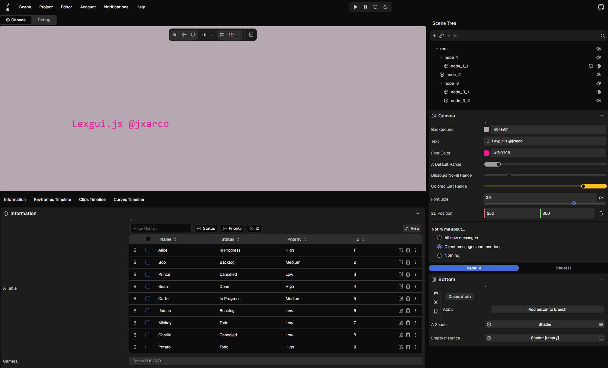
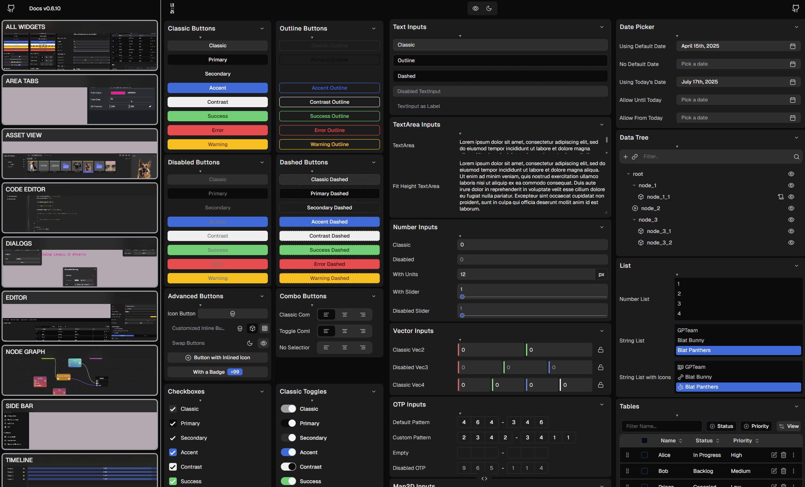

[![NPM Package][npm]][npm-url]
[![NPM Downloads][npm-downloads]][npmtrends-url]
[![jsDelivr Downloads][jsdelivr-downloads]][jsdelivr-url]

**lexgui.js** is a lightweight JavaScript library for building web user interfaces. No bloated frameworks, no unnecessary complexity, just pure HTML, CSS, and JavaScript magic. It gives you an easy API for crafting dynamic, interactive editor interfaces without the headache of big libraries.

NPM Package: [npmjs.com/package/lexgui](https://www.npmjs.com/package/lexgui)

<table>
  <tr>
    <td valign="top"></td>
    <td valign="top"></td>
  </tr>
</table>

<table>
  <tr>
    <td valign="top"><h3>Code Editor</h3></td>
    <td valign="top"><h3>Node Graph Editor</h3></td>
  </tr>
</table>

## Extension Features

- [x] Timeline
- [x] Code Editor
- [x] Docs Maker
- [ ] Node Graph Editor (WIP)
- [ ] Video Editor (WIP)
- [ ] Immediate UI (WIP)

## Quick start

`index.html`:

```html
<!DOCTYPE html>
<html lang="en">
<head>
    <meta http-equiv="Content-Type" content="text/html; charset=iso-8859-1" />
    <title>My first lexgui.js app</title>
    <link rel="stylesheet" href="https://cdn.skypack.dev/lexgui@^<version>/build/lexgui.css">
    <script type="importmap">
        {
          "imports": {
            "lexgui": "https://cdn.skypack.dev/lexgui@^<version>/build/lexgui.module.js",
            "lexgui/extensions/": "https://cdn.skypack.dev/lexgui@^<version>/build/extensions/"
          }
        }
    </script>
</head>
<body>
	<script type="module" src="my_app.js"></script>
<body>
</html>
```

`my_app.js`:

```js
import { LX } from 'lexgui';

// Using extensions
import { CodeEditor } from 'lexgui/extensions/CodeEditor.js';

// Create main area
let area = await LX.init();

// Create area panels
let panel = area.addPanel();

// Start branch/section
panel.branch("Section Title");

// Add some components
panel.addButton(null, "Click me, Im Full Width...");
panel.addText("Text", "Warning text", null, { warning: true });

// Close section
panel.merge();
```

## Docs

The library documentation is available at [lexgui.js/docs/](https://jxarco.github.io/lexgui.js/docs/). 

## Examples

Look at this [examples](https://jxarco.github.io/lexgui.js/examples/) to see how to create the different components and integrate the extensions!

## Projects using lexgui.js

<table>
  <tr>
    <td valign="top"><h3>Animics (EU H2020 SignON project)</h3><a href="https://github.com/upf-gti/animics">github.com/upf-gti/animics</a><br><br></td>
    <td valign="top"><h3>Performs (EU H2020 SignON project)</h3><a href="https://github.com/upf-gti/performs">github.com/upf-gti/performs</a><br><br></td>
  </tr>
</table>

## Feedback/Issues

You can use the [repository issues section](https://github.com/jxarco/lexgui.js/issues) or simply write any feedback to alexroco.30@gmail.com.

[npm]: https://img.shields.io/npm/v/lexgui
[npm-url]: https://www.npmjs.com/package/lexgui
[npm-downloads]: https://img.shields.io/npm/dw/lexgui
[npmtrends-url]: https://www.npmtrends.com/lexgui
[jsdelivr-downloads]: https://data.jsdelivr.com/v1/package/npm/lexgui/badge?style=rounded
[jsdelivr-url]: https://www.jsdelivr.com/package/npm/lexgui