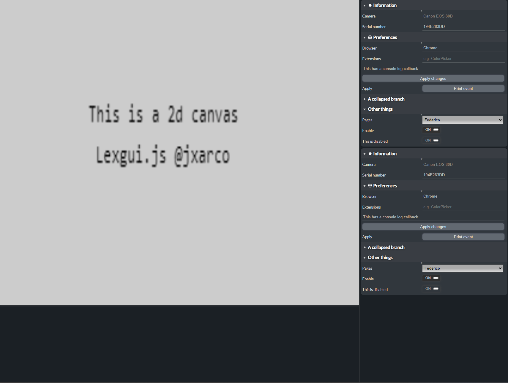

# lexgui.js

**lexgui.js** is a lightweight JavaScript library that allows you to create web interfaces using only JavaScript, HTML, and CSS. This library provides an easy-to-use API for building dynamic and interactive user interfaces without the need for complex frameworks or libraries. With lexgui.js, you can create custom UI components, handle user interactions, and update the interface dynamically.

## Docs

The library documentation is in progress but you can check it [here](https://jxarco.github.io/lexgui.js/docs/).

## Examples

Look at this [examples](https://jxarco.github.io/lexgui.js/examples/) to see how to create the different widgets and components!

## Contributors

* Alex Rodríguez @jxarco
* Eva Valls @evallsg

---

## Features

- [x] Fix closed-by-default branch
- [x] Fix close branch when not last
- [x] Update Combo Theme
- [x] Update Checkbox Theme
- [x] Hide cursor when dragging resize bar
- [x] Color Widget
- [x] Branch separator
- [x] Title widget
- [x] Include fontAwesome Icons
- [x] Store initial value and Add reset value button for widgets
- [x] Vector Widgets
- [x] Add min-max to vector widgets
- [x] Create "Widget" class to implement different value getters
- [x] Addnumber/Slider widgets
- [x] Tabs widget (Blender)
- [x] Tree Widget
- [x] Filter Widgets bar
- [x] Menubar
- [x] Add icons buttons to tree title
- [x] Node filter in tree widget
- [x] Fix scrollbar spaces in right sides
- [x] Add icons + mini-text (shortcut normally) to menubar entries
- [x] Progression bar
- [x] Fix menubar submenus if not on top
- [x] Support horizontal tabs widget (i made vertical ones)
- [x] Support oninput listener (trigger = input) in textwidgets
- [x] Start Documentation
- [x] Event system
- [x] Context Menus
- [x] Add title to any subentry in context menus
- [x] Create addPanel to avoid instancing and attaching a panel to an area
- [x] Resize callbacks
- [x] Timeline
- [x] Fix filter properties (separator is not in right place)
- [x] Open context menus the other way around if not enough space (vertical!!!)
- [x] Dialogs
- [x] Multiple widgets per row
- [x] Load File widget
- [x] Layers widget
- [x] Array widget
- [x] Refresh array widget on change
- [x] Use default Value in Layers widget
- [x] Add reset widget in Layers widget
- [x] List Widget
- [x] Menubar: Support buttons
- [x] Tree item icons
- [x] Branchtabs
- [x] Image Dropdown
- [x] Copy Paste Widget Value
- [x] Custom Class Widget
- [x] Tags Widget
- [x] Write tags
- [x] Custom widget callback
- [x] Global menu searchbar
- [x] Simple Docking System
- [x] Fix dropdown elements when scroll, on dialog, ..
- [x] Allow checkbox suboptions
- [x] Menubar: Support subitem checkboxes
- [x] Fix Array delete item button
- [x] Show checkbox entries in search bar
- [x] Tree multiple selection
- [x] Area Overlay panel
- [x] Minimisable tiny dialog (fast option to debugg)
- [x] Asset Browser
- [ ] Fix menubar entry with checkbox and icon
- [ ] Drag elements to timeline to animate
- Components:
    - [x] Timeline
    - [ ] Node Graphs
