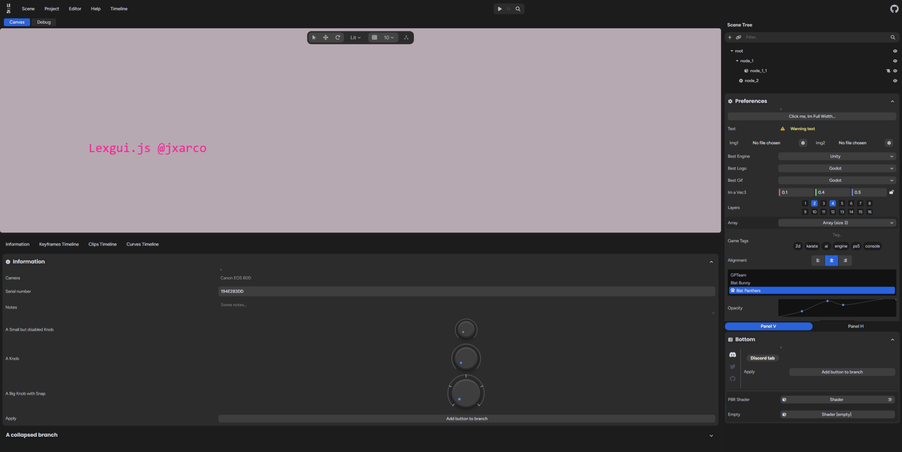
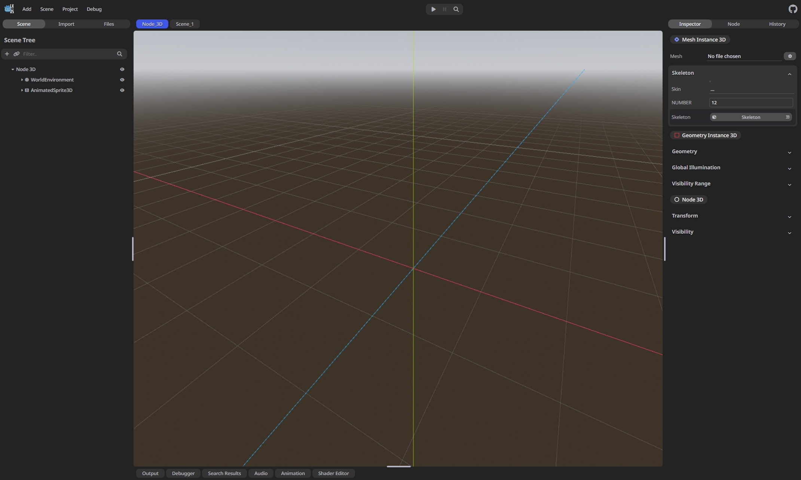
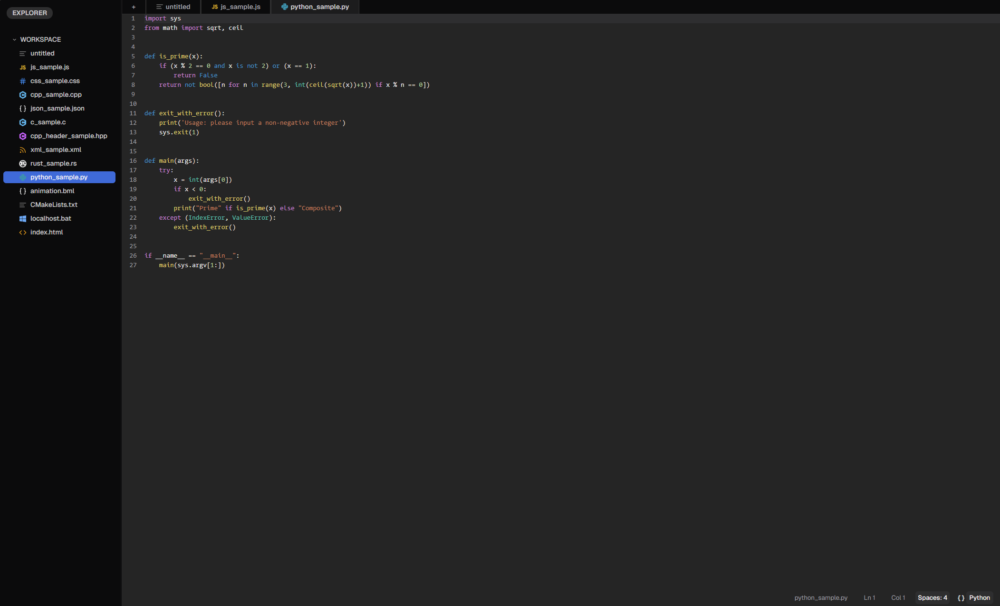
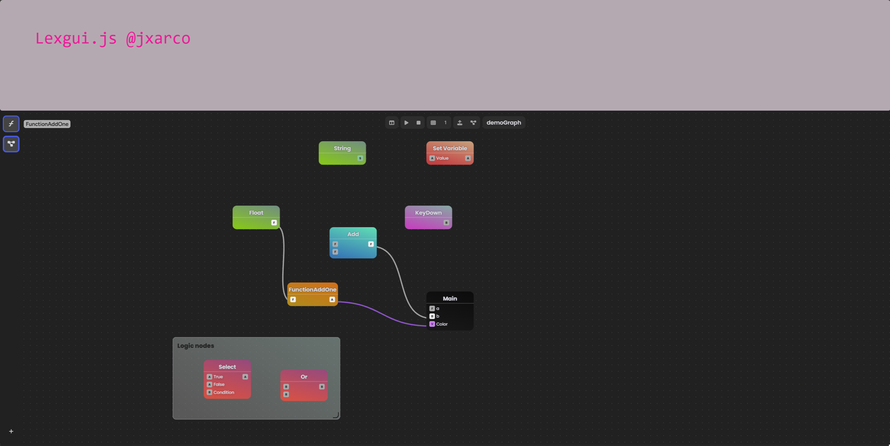
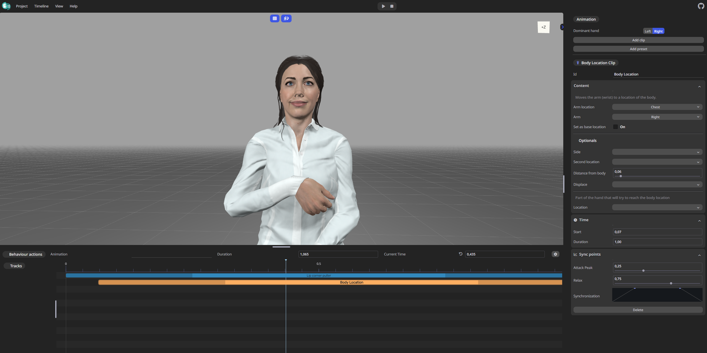
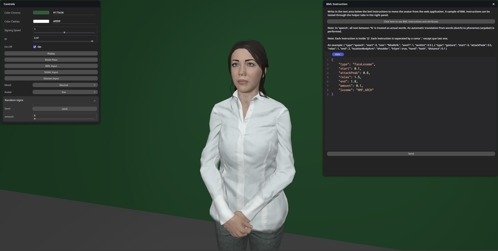

# lexgui.js

**lexgui.js** is a lightweight JavaScript library that allows you to create web interfaces using only JavaScript, HTML, and CSS. It provides an easy-to-use API for building dynamic and interactive common and complex editor interfaces without the need for tedious frameworks or big libraries. With lexgui.js, you can create custom UI components, handle user interactions, and update the interface dynamically.

<table>
  <tr>
    <td valign="top"></td>
    <td valign="top"></td>
  </tr>
</table>

<table>
  <tr>
    <td valign="top"><h3>Code Editor</h3></td>
    <td valign="top"><h3>Node Graph Editor (WIP)</h3></td>
  </tr>
</table>

## Component Features

- [x] Asset Browser
- [x] Timeline
- [x] Code Editor
- [ ] Node Graphs (WIP)

## Quick start

`index.html`:

```html
<!DOCTYPE html>
<html lang="en">
<head>
    <meta http-equiv="Content-Type" content="text/html; charset=iso-8859-1" />
    <title>My first lexgui.js app</title>
    <link rel="stylesheet" href="https://cdn.skypack.dev/lexgui@^<version>/build/lexgui.css">
    <script type="importmap">
        {
          "imports": {
            "lexgui": "https://cdn.skypack.dev/lexgui@^<version>/build/lexgui.module.js",
            "lexgui/components/": "https://cdn.skypack.dev/lexgui@^<version>/build/components/"
          }
        }
    </script>
</head>
<body>
	<script type="module" src="my_app.js"></script>
<body>
</html>
```

`my_app.js`:

```js
import { LX } from 'lexgui';

// Using components
import { CodeEditor } from 'lexgui/components/codeeditor.js';

// Create main area
let area = LX.init();

// Create area panels
let panel = area.addPanel();

// Start branch/section
panel.branch("Section Title");

// Add some widgets
panel.addButton(null, "Click me, Im Full Width...");
panel.addText("Text", "Warning text", null, { warning: true });

// Close section
panel.merge();
```

## Docs

The library documentation is available at [lexgui.js/docs/](https://jxarco.github.io/lexgui.js/docs/). 

## Examples

Look at this [examples](https://jxarco.github.io/lexgui.js/examples/) to see how to create the different widgets and components!

## Projects using lexgui.js

<table>
  <tr>
    <td valign="top"><h3>Animics (EU H2020 SignON project)</h3><a href="https://github.com/upf-gti/animics">github.com/upf-gti/animics</a><br><br></td>
    <td valign="top"><h3>Performs (EU H2020 SignON project)</h3><a href="https://github.com/upf-gti/performs">github.com/upf-gti/performs</a><br><br></td>
  </tr>
</table>

## Contributors

* Alex Rodríguez @jxarco
* Eva Valls @evallsg

## Feedback/Issues

You can use the [repository issues section](https://github.com/jxarco/lexgui.js/issues) or simply write any feedback to alexroco.30@gmail.com.